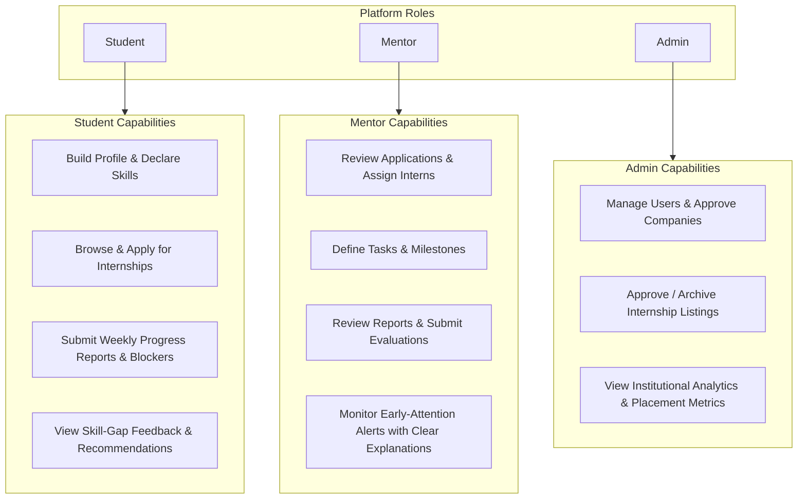
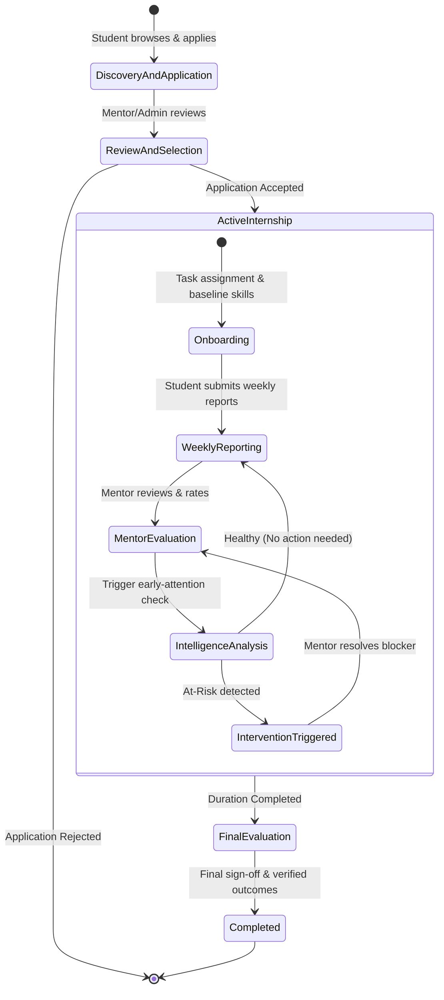
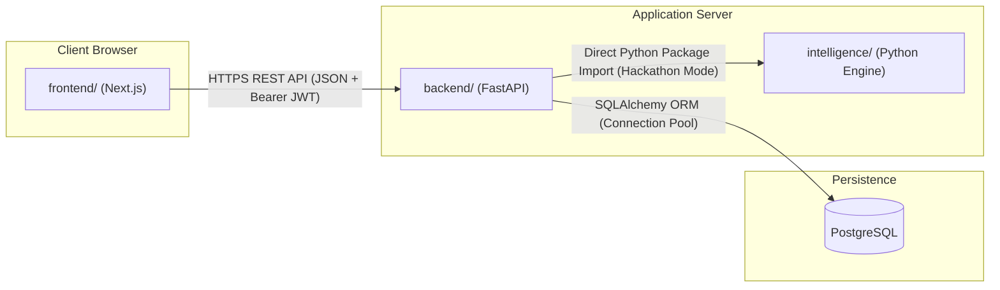
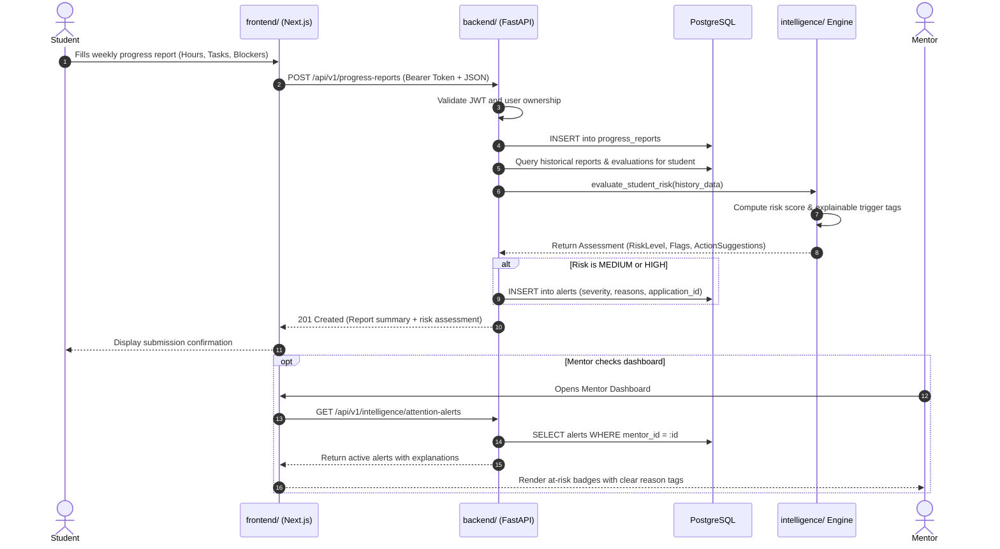
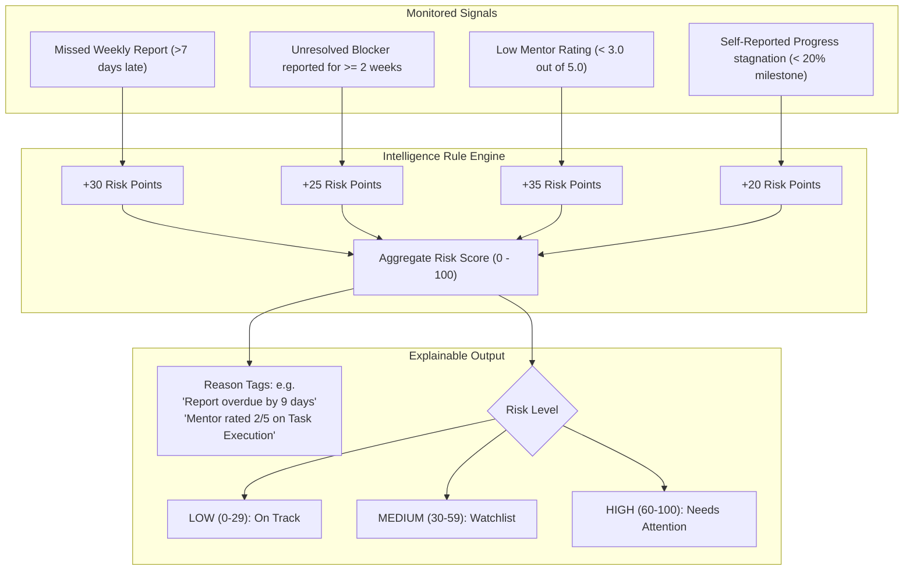

# System Architecture: Smart Internship Management and Monitoring System

## 1. Project Purpose & Scope

The **Smart Internship Management and Monitoring System** is a unified platform designed to streamline the lifecycle of academic and industrial internships. In conventional systems, internship management is often limited to job boards, resume uploads, or static document repositories. As a result, mentors and administrators often discover that a student is struggling, disengaged, or blocked only at the very end of the internship period.

### Hackathon Scope (48 Hours)
To deliver maximum reliability and value within a 48-hour development window, the architecture is intentionally focused and pragmatic:
- **Simple, Decoupled Monorepo**: Clean folder separation (`frontend/`, `backend/`, `intelligence/`) sharing a unified domain model.
- **RESTful API**: Straightforward HTTP/JSON endpoints without GraphQL or complex messaging broker overhead.
- **Explainable Differentiation**: Rather than claiming novel machine learning models or suggesting existing systems lack progress tracking, our core differentiator is an **explainable internship progress monitoring and early-attention layer**. It transparently surfaces *why* an intern is flagged for attention (e.g., missed report deadlines, unresolved blockers, falling mentor satisfaction scores) and provides actionable guidance to prevent internship dropouts.

---

## 2. User Roles & Capabilities

The system defines three core roles governed by Role-Based Access Control (RBAC):



### Role Breakdown
1. **Student**:
   - Maintains profile information, academic records, and self-assessed skill proficiencies.
   - Searches active internships and submits applications.
   - Submits periodic (e.g., weekly) progress reports detailing completed hours, tasks done, and technical blockers.
   - Accesses skill-gap reports comparing their profile against internship requirements.
2. **Mentor (Industry or Academic Guide)**:
   - Reviews and shortlists candidate applications.
   - Oversees assigned interns, defines milestone tasks, and reviews weekly report submissions.
   - Submits qualitative evaluations and numeric satisfaction ratings.
   - Receives early-intervention flags indicating students needing immediate support.
3. **Admin (University Coordinator or Platform Admin)**:
   - Manages institutional settings, approves registered companies and internship postings.
   - Monitors holistic cohort analytics (total active internships, at-risk percentage, completion rates).
   - Resolves account issues and ensures policy compliance.

---

## 3. Complete Internship Lifecycle

The lifecycle moves through six distinct phases:



1. **Discovery & Application**: Employers post internship opportunities; students discover listings and apply with their skill profiles.
2. **Review & Selection**: Mentors evaluate applicant profiles, review skill compatibility, and accept or reject candidates.
3. **Onboarding & Baseline Setup**: Upon acceptance, the mentor outlines core project tasks, and the initial skill baseline is recorded.
4. **Active Weekly Reporting**: Every week, the student submits a structured report covering hours worked, tasks completed, self-assessment, and blockers encountered.
5. **Intelligence & Early Attention**: The system ingests report cadences, blocker durations, and mentor ratings to compute an explainable risk indicator. If a student is flagged, the mentor receives targeted reasons (e.g., "Report missed for 2 consecutive weeks").
6. **Final Evaluation & Sign-off**: The mentor conducts a closing evaluation, compares final skill attainment with initial requirements, and marks the internship completed.

---

## 4. Module Responsibilities

The monorepo is partitioned into three dedicated modules:

| Module | Primary Technologies | Key Responsibilities |
|---|---|---|
| **frontend/** | Next.js (App Router), React, TypeScript, Tailwind CSS | - Responsive, role-based dashboards (Student, Mentor, Admin)<br>- Application and reporting forms with client-side validation<br>- Progress timelines, skill-gap visualization, and alert badges<br>- Token storage and authenticated routing guards |
| **backend/** | FastAPI, Python 3.11+, PostgreSQL, SQLAlchemy, Pydantic | - High-performance asynchronous REST API<br>- JWT-based authentication & RBAC middleware<br>- Relational data persistence and ACID transactions<br>- Orchestrating calls to the intelligence analysis engine |
| **intelligence/** | Python (Pydantic, NumPy/Pandas or pure Python heuristics) | - Skill-gap analysis (set-difference & proficiency comparison)<br>- Rule-based progress tracking and risk calculation<br>- Explainability engine generating plain-text justification tags<br>- Actionable recommendation generation for mentors & students |

---

## 5. Module Communication Architecture

For a 48-hour hackathon, simplicity and low operational overhead are critical. Rather than setting up complex microservices, message queues, or distributed service meshes, communication follows a clean and robust pattern:



1. **Frontend to Backend**:
   - Standard RESTful JSON over HTTPS.
   - All protected routes require an `Authorization: Bearer <jwt_token>` header.
2. **Backend to Intelligence**:
   - In the hackathon context, `intelligence/` is packaged as an internal Python module imported directly by `backend/` service routines (`from intelligence.engine import analyze_progress, compute_skill_gap`).
   - Clean data schemas (Pydantic DTOs) are passed between Backend and Intelligence.
   - *Future-Proof Design*: Because the interface relies strictly on input/output schemas, the intelligence layer can be deployed as an independent microservice in the future without changing business logic.
3. **Backend to Database**:
   - Only the backend module talks to PostgreSQL via SQLAlchemy / asyncpg. Neither frontend nor intelligence interacts directly with the database.

---

## 6. Overall Data Flow

A typical operational cycle (e.g., student submits a weekly progress report) flows as follows:



---

## 7. Authentication & Authorization Flow

Authentication uses standard, secure JSON Web Tokens (JWT):

```mermaid
sequenceDiagram
    autonumber
    actor User as User (Student/Mentor/Admin)
    participant FE as Frontend Client
    participant BE as Backend API
    participant DB as PostgreSQL

    User->>FE: Submits Email & Password
    FE->>BE: POST /api/v1/auth/login
    BE->>DB: SELECT * FROM users WHERE email = :email
    DB-->>BE: Return user record (with hashed_password)
    BE->>BE: Verify bcrypt password hash
    BE->>BE: Generate JWT token (sub=user_id, role=role, exp=24h)
    BE-->>FE: 200 OK { access_token, token_type: "bearer", user: {...} }
    FE->>FE: Store token in secure storage / HttpOnly cookie
    
    note over FE,BE: Subsequent Authenticated Requests
    FE->>BE: GET /api/v1/protected-endpoint (Authorization: Bearer <token>)
    BE->>BE: Decode & verify signature; check expiration
    BE->>BE: Enforce Role Guard (e.g., Require 'mentor' or 'admin')
    BE-->>FE: 200 OK (Protected Data)
```

- **Password Hashing**: Passwords stored as bcrypt hashes; plaintext passwords are never logged or stored.
- **Payload Claims**: Tokens carry minimal claims (`sub` [User ID], `role`, `exp`).
- **FastAPI Dependencies**: Protected endpoints declare dependencies like `Depends(get_current_user)` and `Depends(require_role(["mentor", "admin"]))`.

---

## 8. Intelligence Layer Architecture & Explainability

### Core Objectives
1. Identify skill gaps between a student's existing skillset and an internship's technical expectations.
2. Continuously monitor progress report cadence and content to identify students at risk of falling behind.
3. Provide **explainable, transparent rationales** so mentors can take immediate, targeted corrective action rather than guessing why an alert was fired.

### Heuristic Scoring Model (Practical for 48h)
Rather than an uninterpretable deep neural network, the system uses a transparent, deterministic heuristic scoring model:



### Explainability Output Schema
The intelligence module returns structured results designed for direct UI rendering:

```json
{
  "student_id": "uuid-1234",
  "application_id": "uuid-5678",
  "risk_score": 65,
  "risk_level": "HIGH",
  "attention_needed": true,
  "flagged_reasons": [
    "No progress report submitted for the past 10 days (Deadline: 7 days)",
    "Student reported an active blocker: 'Stuck on Docker configuration' for 2 consecutive cycles",
    "Latest mentor satisfaction rating was 2.5/5.0"
  ],
  "recommended_actions": [
    "Mentor should schedule a 15-minute 1-on-1 check-in",
    "Review technical blockers related to Docker environment setup"
  ],
  "evaluated_at": "2026-09-16T13:30:00Z"
}
```

This ensures that whenever an alert appears on the mentor's dashboard, the mentor immediately understands the underlying reasons and can intervene constructively.
