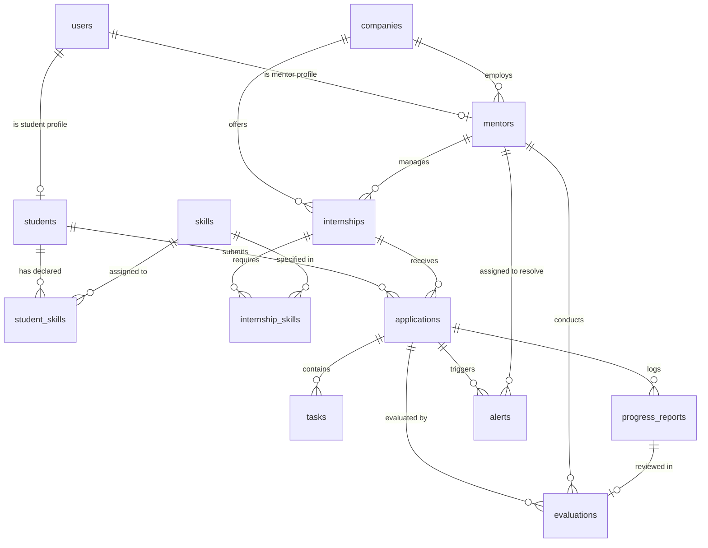

# Database Schema: Smart Internship Management and Monitoring System

This document outlines the relational data model for the PostgreSQL database managed by SQLAlchemy/FastAPI. The schema is designed to balance normalization with simplicity, ensuring high productivity and rapid querying during a 48-hour hackathon.

---

## 1. Entity-Relationship (ER) Diagram

---

## 2. Data Dictionary & Entity Definitions

### 2.1 `users`
Core identity table representing all platform actors.
- **Primary Key**: `id` (UUID)
- **Fields**:
  | Column | Type | Constraints | Description |
  |---|---|---|---|
  | `id` | UUID | PK, default `gen_random_uuid()` | Unique user ID |
  | `email` | VARCHAR(255) | UNIQUE, NOT NULL, indexed | User login email address |
  | `password_hash` | VARCHAR(255) | NOT NULL | Bcrypt hashed password string |
  | `full_name` | VARCHAR(255) | NOT NULL | User's full display name |
  | `role` | VARCHAR(50) | NOT NULL | User role: `'student'`, `'mentor'`, `'admin'` |
  | `is_active` | BOOLEAN | NOT NULL, default `TRUE` | Account active toggle |
  | `created_at` | TIMESTAMP WITH TIME ZONE | NOT NULL, default `NOW()` | Registration timestamp |
  | `updated_at` | TIMESTAMP WITH TIME ZONE | NOT NULL, default `NOW()` | Last profile update timestamp |
- **Relationships**:
  - 1-to-1 with `students` (`user_id`)
  - 1-to-1 with `mentors` (`user_id`)

---

### 2.2 `students`
Academic and profile details specific to student accounts.
- **Primary Key**: `id` (UUID)
- **Foreign Keys**: `user_id` -> `users(id)` ON DELETE CASCADE
- **Fields**:
  | Column | Type | Constraints | Description |
  |---|---|---|---|
  | `id` | UUID | PK, default `gen_random_uuid()` | Unique student record ID |
  | `user_id` | UUID | UNIQUE, NOT NULL, FK -> `users.id` | Associated base user identity |
  | `university` | VARCHAR(255) | NULLABLE | Enrolled educational institution |
  | `department` | VARCHAR(255) | NULLABLE | Major / field of study |
  | `year_of_study` | INTEGER | NULLABLE | Current academic year (e.g., 1 to 5) |
  | `gpa` | NUMERIC(3, 2) | NULLABLE | Cumulative Grade Point Average |
  | `bio` | TEXT | NULLABLE | Personal summary / career statement |
  | `resume_url` | VARCHAR(500) | NULLABLE | Link to hosted resume file |
  | `created_at` | TIMESTAMP WITH TIME ZONE | NOT NULL, default `NOW()` | Profile creation time |
  | `updated_at` | TIMESTAMP WITH TIME ZONE | NOT NULL, default `NOW()` | Profile update time |
- **Relationships**:
  - 1-to-Many with `applications` (`student_id`)
  - 1-to-Many with `student_skills` (`student_id`)

---

### 2.3 `mentors`
Industry and academic supervisor profiles.
- **Primary Key**: `id` (UUID)
- **Foreign Keys**:
  - `user_id` -> `users(id)` ON DELETE CASCADE
  - `company_id` -> `companies(id)` ON DELETE SET NULL
- **Fields**:
  | Column | Type | Constraints | Description |
  |---|---|---|---|
  | `id` | UUID | PK, default `gen_random_uuid()` | Unique mentor record ID |
  | `user_id` | UUID | UNIQUE, NOT NULL, FK -> `users.id` | Associated base user identity |
  | `company_id` | UUID | NULLABLE, FK -> `companies.id` | Associated organization/company |
  | `job_title` | VARCHAR(255) | NULLABLE | Professional title (e.g., Tech Lead) |
  | `department` | VARCHAR(255) | NULLABLE | Engineering, Product, Research, etc. |
  | `expertise_summary`| TEXT | NULLABLE | Brief background and mentoring focus |
  | `created_at` | TIMESTAMP WITH TIME ZONE | NOT NULL, default `NOW()` | Profile creation time |
  | `updated_at` | TIMESTAMP WITH TIME ZONE | NOT NULL, default `NOW()` | Profile update time |
- **Relationships**:
  - Many-to-1 with `companies` (`company_id`)
  - 1-to-Many with `internships` (`created_by_mentor_id`)
  - 1-to-Many with `evaluations` (`mentor_id`)
  - 1-to-Many with `alerts` (`mentor_id`)

---

### 2.4 `companies`
Sponsoring employers or academic labs hosting internships.
- **Primary Key**: `id` (UUID)
- **Fields**:
  | Column | Type | Constraints | Description |
  |---|---|---|---|
  | `id` | UUID | PK, default `gen_random_uuid()` | Unique company ID |
  | `name` | VARCHAR(255) | NOT NULL, UNIQUE | Official company or organization name |
  | `website` | VARCHAR(255) | NULLABLE | Corporate website URL |
  | `industry` | VARCHAR(100) | NULLABLE | Sector (e.g., Cloud, FinTech, HealthTech) |
  | `description` | TEXT | NULLABLE | Brief company overview |
  | `created_at` | TIMESTAMP WITH TIME ZONE | NOT NULL, default `NOW()` | Creation timestamp |
  | `updated_at` | TIMESTAMP WITH TIME ZONE | NOT NULL, default `NOW()` | Update timestamp |
- **Relationships**:
  - 1-to-Many with `mentors` (`company_id`)
  - 1-to-Many with `internships` (`company_id`)

---

### 2.5 `internships`
Internship postings and positions.
- **Primary Key**: `id` (UUID)
- **Foreign Keys**:
  - `company_id` -> `companies(id)` ON DELETE CASCADE
  - `created_by_mentor_id` -> `mentors(id)` ON DELETE SET NULL
- **Fields**:
  | Column | Type | Constraints | Description |
  |---|---|---|---|
  | `id` | UUID | PK, default `gen_random_uuid()` | Unique internship posting ID |
  | `company_id` | UUID | NOT NULL, FK -> `companies.id` | Host company |
  | `created_by_mentor_id` | UUID | NULLABLE, FK -> `mentors.id` | Listing owner / supervising mentor |
  | `title` | VARCHAR(255) | NOT NULL | Position title |
  | `description` | TEXT | NOT NULL | Detailed role requirements & deliverables |
  | `location` | VARCHAR(255) | NOT NULL | E.g. `"Remote"`, `"New York, NY"` |
  | `duration_weeks` | INTEGER | NOT NULL | Expected duration in weeks |
  | `stipend` | NUMERIC(10, 2) | NULLABLE | Monthly or total stipend amount |
  | `status` | VARCHAR(50) | NOT NULL, default `'open'` | `'open'`, `'closed'`, `'archived'` |
  | `created_at` | TIMESTAMP WITH TIME ZONE | NOT NULL, default `NOW()` | Posting timestamp |
  | `updated_at` | TIMESTAMP WITH TIME ZONE | NOT NULL, default `NOW()` | Modification timestamp |
- **Relationships**:
  - Many-to-1 with `companies` (`company_id`)
  - 1-to-Many with `internship_skills` (`internship_id`)
  - 1-to-Many with `applications` (`internship_id`)

---

### 2.6 `skills`
Master catalog of technical and soft skills.
- **Primary Key**: `id` (UUID)
- **Fields**:
  | Column | Type | Constraints | Description |
  |---|---|---|---|
  | `id` | UUID | PK, default `gen_random_uuid()` | Unique skill ID |
  | `name` | VARCHAR(100) | UNIQUE, NOT NULL, indexed | Standardized name (e.g., `"Python"`, `"Docker"`) |
  | `category` | VARCHAR(100) | NULLABLE | E.g., `"Backend"`, `"DevOps"`, `"Frontend"` |
  | `created_at` | TIMESTAMP WITH TIME ZONE | NOT NULL, default `NOW()` | Record timestamp |
- **Relationships**:
  - 1-to-Many with `internship_skills` (`skill_id`)
  - 1-to-Many with `student_skills` (`skill_id`)

---

### 2.7 `student_skills`
Association table linking students to self-declared skills and proficiencies.
- **Primary Key**: `id` (UUID)
- **Foreign Keys**:
  - `student_id` -> `students(id)` ON DELETE CASCADE
  - `skill_id` -> `skills(id)` ON DELETE RESTRICT
- **Unique Constraint**: `UNIQUE(student_id, skill_id)`
- **Fields**:
  | Column | Type | Constraints | Description |
  |---|---|---|---|
  | `id` | UUID | PK, default `gen_random_uuid()` | Record ID |
  | `student_id` | UUID | NOT NULL, FK -> `students.id` | Student reference |
  | `skill_id` | UUID | NOT NULL, FK -> `skills.id` | Skill reference |
  | `proficiency` | VARCHAR(50) | NOT NULL | `'beginner'`, `'intermediate'`, `'advanced'` |
  | `verified` | BOOLEAN | NOT NULL, default `FALSE` | Mentor verified badge |
  | `created_at` | TIMESTAMP WITH TIME ZONE | NOT NULL, default `NOW()` | Timestamp added |

---

### 2.8 `internship_skills`
Prerequisite technical skills attached to an internship posting.
- **Primary Key**: `id` (UUID)
- **Foreign Keys**:
  - `internship_id` -> `internships(id)` ON DELETE CASCADE
  - `skill_id` -> `skills(id)` ON DELETE RESTRICT
- **Unique Constraint**: `UNIQUE(internship_id, skill_id)`
- **Fields**:
  | Column | Type | Constraints | Description |
  |---|---|---|---|
  | `id` | UUID | PK, default `gen_random_uuid()` | Record ID |
  | `internship_id` | UUID | NOT NULL, FK -> `internships.id` | Internship posting reference |
  | `skill_id` | UUID | NOT NULL, FK -> `skills.id` | Skill requirement reference |
  | `min_proficiency` | VARCHAR(50) | NOT NULL | Expected level: `'beginner'`, `'intermediate'`, `'advanced'` |
  | `is_mandatory` | BOOLEAN | NOT NULL, default `TRUE` | Whether the skill is strictly required |

---

### 2.9 `applications`
Student applications for specific internship postings. When accepted, this record acts as the primary anchor for monitoring the active internship.
- **Primary Key**: `id` (UUID)
- **Foreign Keys**:
  - `internship_id` -> `internships(id)` ON DELETE CASCADE
  - `student_id` -> `students(id)` ON DELETE CASCADE
- **Unique Constraint**: `UNIQUE(internship_id, student_id)`
- **Fields**:
  | Column | Type | Constraints | Description |
  |---|---|---|---|
  | `id` | UUID | PK, default `gen_random_uuid()` | Application record ID |
  | `internship_id` | UUID | NOT NULL, FK -> `internships.id` | Target internship |
  | `student_id` | UUID | NOT NULL, FK -> `students.id` | Applicant student |
  | `status` | VARCHAR(50) | NOT NULL, default `'applied'` | `'applied'`, `'under_review'`, `'accepted'`, `'rejected'`, `'completed'` |
  | `statement_of_purpose` | TEXT | NULLABLE | Cover note or motivation statement |
  | `portfolio_url` | VARCHAR(500) | NULLABLE | GitHub, portfolio, or project demo link |
  | `feedback_notes` | TEXT | NULLABLE | Mentor feedback during review |
  | `applied_at` | TIMESTAMP WITH TIME ZONE | NOT NULL, default `NOW()` | Submission timestamp |
  | `updated_at` | TIMESTAMP WITH TIME ZONE | NOT NULL, default `NOW()` | Status update timestamp |
- **Relationships**:
  - Many-to-1 with `internships` (`internship_id`)
  - Many-to-1 with `students` (`student_id`)
  - 1-to-Many with `progress_reports` (`application_id`)
  - 1-to-Many with `tasks` (`application_id`)
  - 1-to-Many with `evaluations` (`application_id`)
  - 1-to-Many with `alerts` (`application_id`)

---

### 2.10 `tasks`
Milestones and actionable work items assigned to an intern.
- **Primary Key**: `id` (UUID)
- **Foreign Keys**: `application_id` -> `applications(id)` ON DELETE CASCADE
- **Fields**:
  | Column | Type | Constraints | Description |
  |---|---|---|---|
  | `id` | UUID | PK, default `gen_random_uuid()` | Task record ID |
  | `application_id` | UUID | NOT NULL, FK -> `applications.id` | Active internship placement |
  | `title` | VARCHAR(255) | NOT NULL | Task summary |
  | `description` | TEXT | NULLABLE | Acceptance criteria / specifications |
  | `due_date` | DATE | NULLABLE | Target completion date |
  | `status` | VARCHAR(50) | NOT NULL, default `'pending'` | `'pending'`, `'in_progress'`, `'completed'`, `'blocked'` |
  | `created_at` | TIMESTAMP WITH TIME ZONE | NOT NULL, default `NOW()` | Assignment timestamp |
  | `updated_at` | TIMESTAMP WITH TIME ZONE | NOT NULL, default `NOW()` | Last state change |

---

### 2.11 `progress_reports`
Weekly submissions logged by student interns to chronicle work, time, and hurdles.
- **Primary Key**: `id` (UUID)
- **Foreign Keys**: `application_id` -> `applications(id)` ON DELETE CASCADE
- **Unique Constraint**: `UNIQUE(application_id, week_number)`
- **Fields**:
  | Column | Type | Constraints | Description |
  |---|---|---|---|
  | `id` | UUID | PK, default `gen_random_uuid()` | Progress report ID |
  | `application_id` | UUID | NOT NULL, FK -> `applications.id` | Active placement reference |
  | `week_number` | INTEGER | NOT NULL | Week number in internship timeline |
  | `hours_worked` | NUMERIC(5, 2) | NOT NULL | Logged hours for the week |
  | `tasks_completed` | TEXT | NOT NULL | Summary of completed deliverables |
  | `tasks_in_progress`| TEXT | NULLABLE | Ongoing work items |
  | `blockers` | TEXT | NULLABLE | Technical hurdles, access issues, or questions |
  | `self_satisfaction_rating` | INTEGER | NOT NULL | Student self-rating (1 to 5) |
  | `submitted_at` | TIMESTAMP WITH TIME ZONE | NOT NULL, default `NOW()` | Submission timestamp |
- **Relationships**:
  - Many-to-1 with `applications` (`application_id`)
  - 1-to-1 (optional) with `evaluations` (`progress_report_id`)

---

### 2.12 `evaluations`
Mentor periodic ratings and qualitative reviews of student intern performance.
- **Primary Key**: `id` (UUID)
- **Foreign Keys**:
  - `application_id` -> `applications(id)` ON DELETE CASCADE
  - `progress_report_id` -> `progress_reports(id)` ON DELETE SET NULL
  - `mentor_id` -> `mentors(id)` ON DELETE RESTRICT
- **Fields**:
  | Column | Type | Constraints | Description |
  |---|---|---|---|
  | `id` | UUID | PK, default `gen_random_uuid()` | Evaluation ID |
  | `application_id` | UUID | NOT NULL, FK -> `applications.id` | Active placement reference |
  | `progress_report_id` | UUID | NULLABLE, FK -> `progress_reports.id` | Specific report evaluated (if applicable) |
  | `mentor_id` | UUID | NOT NULL, FK -> `mentors.id` | Evaluating mentor |
  | `performance_rating` | NUMERIC(3, 2) | NOT NULL | Overall rating (1.00 to 5.00) |
  | `technical_skills_rating` | NUMERIC(3, 2) | NOT NULL | Technical rating (1.00 to 5.00) |
  | `communication_rating` | NUMERIC(3, 2) | NOT NULL | Soft skills / communication (1.00 to 5.00) |
  | `feedback_summary` | TEXT | NOT NULL | Qualitative review text |
  | `recommended_action` | VARCHAR(255) | NULLABLE | Next steps or suggested remediation |
  | `created_at` | TIMESTAMP WITH TIME ZONE | NOT NULL, default `NOW()` | Evaluation timestamp |

---

### 2.13 `alerts`
Early-intervention flags generated by the intelligence engine to proactively alert mentors.
- **Primary Key**: `id` (UUID)
- **Foreign Keys**:
  - `application_id` -> `applications(id)` ON DELETE CASCADE
  - `mentor_id` -> `mentors(id)` ON DELETE CASCADE
- **Fields**:
  | Column | Type | Constraints | Description |
  |---|---|---|---|
  | `id` | UUID | PK, default `gen_random_uuid()` | Alert ID |
  | `application_id` | UUID | NOT NULL, FK -> `applications.id` | Associated placement |
  | `mentor_id` | UUID | NOT NULL, FK -> `mentors.id` | Assigned mentor notified |
  | `severity` | VARCHAR(50) | NOT NULL | `'LOW'`, `'MEDIUM'`, `'HIGH'` |
  | `risk_score` | INTEGER | NOT NULL | Computed score (0 to 100) |
  | `flagged_reasons` | JSONB | NOT NULL | Array of human-readable explainability strings |
  | `suggested_interventions` | JSONB | NULLABLE | Array of recommended mentor actions |
  | `is_resolved` | BOOLEAN | NOT NULL, default `FALSE` | Resolution status toggle |
  | `resolved_at` | TIMESTAMP WITH TIME ZONE | NULLABLE | When the mentor resolved the alert |
  | `created_at` | TIMESTAMP WITH TIME ZONE | NOT NULL, default `NOW()` | Alert generation timestamp |

---

## 3. Practical Database Considerations for a 48-Hour Hackathon

1. **UUIDs for Primary Keys**:
   - Every table uses `UUID` (`gen_random_uuid()`) to avoid sequential ID enumeration vulnerabilities and simplify frontend routing without race conditions.
2. **JSONB for Explainability**:
   - `alerts.flagged_reasons` and `alerts.suggested_interventions` use PostgreSQL `JSONB` to store arrays of strings. This enables dynamic explainability text from the intelligence engine without requiring additional join tables.
3. **Foreign Key Indexing**:
   - Ensure explicit B-tree indexes on critical foreign keys (`applications.student_id`, `applications.internship_id`, `progress_reports.application_id`, `alerts.mentor_id`) for fast dashboard query performance.
4. **Enums as Constrained Strings**:
   - Store status and roles as `VARCHAR` with application-level Pydantic enum validation to make schema migrations easy during fast prototyping.
